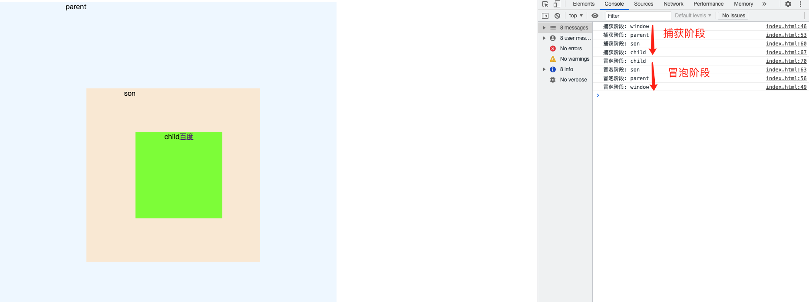

# 详解浏览器事件捕获，冒泡

浏览器事件模型中的过程主要分为3个阶段：捕获阶段 -> 目标阶段 -> 冒泡阶段
看下下面这张经典的图 

## 第三个参数
注意addEventListener的第三个参数
如果为true，则表示在捕获阶段执行，为false则表示在冒泡阶段执行，默认为false。

## 阻止事件传播
e.stopPropagation
大家经常听到的是阻止事件冒泡，实际上这个方法不止能阻止事件冒泡，还能阻止捕获阶段的事件传播。

## 事件委托
编写一个ul li 上的方法，给每个li添加点击事件，点击li显示li的内容以及index索引